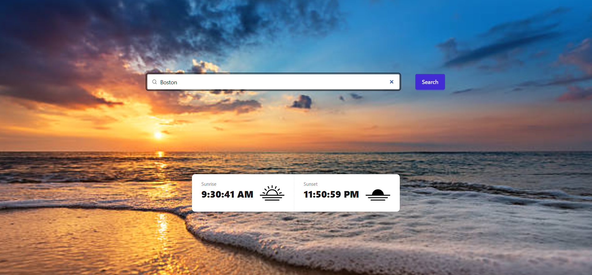

<!-- Title -->

    
    <h2 align="center">Solar Watch</h2>
    

        Full-stack web application to show sunrise and sunset information about cities
    

 

<!-- About the Project -->

    <h4>Features</h4>
    

    Built in React and Spring MVC, Solar Watch is a web app that displays sunrise and sunset times for any given city and date.
    

    <ul>
        <li>Sunrise and Sunset Times: Users can input a city and date to retrieve the corresponding sunrise and sunset times.
        <li>User Authentication: The application likely includes user registration and login functionalities to personalize the experience.
        <li>City Management: Users may have the ability to save preferred cities for quicker access to solar data.
        <li>Admin Controls: Administrators could have additional capabilities, such as managing user accounts and overseeing city data (Backend only).
    </ul>

 

<!-- Built with -->

    <h4>Built with</h4>
    
Node.js, React, Tailwind css, DaisyUI, Maven, Java Spring, JUnit, Lombok, PostgreSQL

 

<!-- Prerequisites -->

    <h4>Prerequisites</h4>
    
For Docker: <a href="https://www.docker.com/products/docker-desktop/">Docker desktop</a>

 

<!-- How to run -->

    <h4>How to run</h4>
    <h6>With Docker</h6>
    <ol>
        <li>Download, install and run <a href="https://www.docker.com/products/docker-desktop/">Docker desktop</a>
        <li>Rename .env.example to .env in the root directory
        <li>Fill up .env with the necessary data
        <li>Run docker-start.bat
        <li><a href="http://localhost:5173/solarwatch">Click here</a>
        <li>To stop run docker-stop.bat
    </ol>

